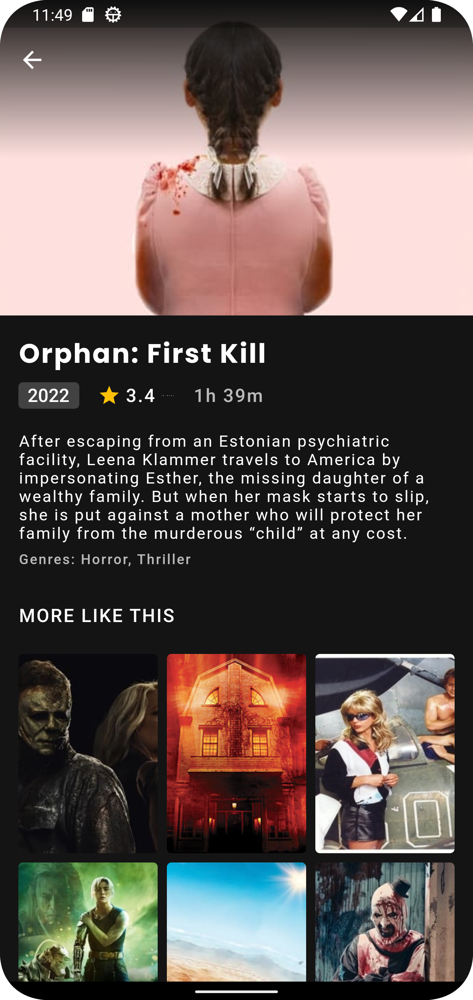

>

# Feshar V2 <i> (Flutter Version) </i>
Mobile application which shows Popular, Now Playing, Top Rated and Upcoming Movies, TvShows and all the details Reviews, Trailer,
Same goes with the TVShows showing Airing Today, OnAir, Popular, and Top Rated shows. Worked on making clean and beautifull UI and UX by using latest Material Designs.
All the data has been fetched from "(TMDB)" - Using a well-defined and decoupled architecture, following TDD (test-driven programming) as a working methodology, Clean Architecture.

## Screenshots

  
  
   
  
  

## Clean Architecture

 - Presentation Layer
 - Domain Layer
 - Data Layer

## Roadmap

| Testing      | Progress |
| :--------- | :-------: |
| Unit       |    ✅     |
| Widgets    |    ✅     |
| Integration |   ☑️      |

## Libraries and Tools

- BLoC 
- BLoC_Test 
- cupertino_icons 
- Equatable 
- Flutter_Bloc 
- Formz
- Service Locator
- Dio 
- http
- Dartz 
- Intl
- Shared_preferences 
- Provider
- Faker 
- Mockito

## Testing

- Unit tests
- Cubit/Stream tests
- Widget Tests
- Navigation tests
- Form Validation tests
- Test Doubles
- Mocks
- Stubs
- Spies

## Requirements✨
- Any Operating System (ie. MacOS X, Linux, Windows)
- Any IDE with Flutter SDK installed (ie. IntelliJ, Android Studio, VSCode etc)
- Some fingers to code 😂
